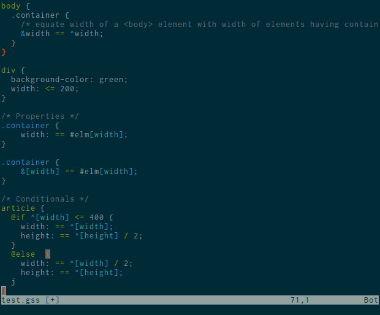

VIM-GSS
=======

A vim syntax bundle for [Grid Style Sheets (GSS)](http://gridstylesheets.org).



Installation
------------

Install as a [pathogen](https://github.com/tpope/vim-pathogen) bundle. If you
do not yet have pathogen, it is recommended that you install it before
installing this plugin.

```
$ cd ~/.vim/bundle
$ git clone https://github.com/Hydrotoast/vim-gss.git
```
